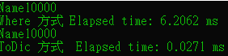

# C# ToDictionary vs Linq Where 或者 FirstOrDefault

在 C# 裡面如果有一個 List 請你找出其中一筆資料，

我想絕大多數的人應該都是選擇 FirstOrDefault 之類的，

不過 FirstOrDefault 它的時間複雜度是 O(N)，

也就是說它只是幫你跑迴圈找而已，

少數資料沒有問題，

但是資料一多效能會很可怕，

建議大家可以利用 PK 把它做成 ToDictionary 再去尋找，

此時時間複雜度是 O(1)，

以下是做的範例假設是找出 Number 為 10000 的物件，

可以自己看一下速率快好幾百倍，

當然也有人說如果我的條件是複數個怎麼辦，

那很簡單你的 PK 就是由這些複數個組成一個字串，

你只要確定你的 ToDictionary 是唯一值即可
