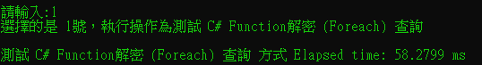
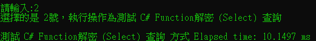
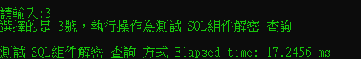
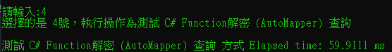

# 解密性能比較

這個 C# 應用程序用於比較不同解密方法在處理數據庫查詢時的性能。它包括使用 C# 函數和 SQL 組件進行解密的多種方法。程序的目的是測量和比較這些方法在實際操作中的執行時間。

## 功能

- 使用 C# Function（Foreach 和 Select）進行解密查詢。
- 使用 AutoMapper 結合 C# Function 進行解密查詢。
- 使用 SQL 組件進行解密查詢。

## 如何運行

1. 確保您的系統已安裝 .NET 環境。
2. 可以執行專案裡的 `LabDemo.sql`，創建 DB、資料表、組件。
3. 在命令行或 IDE 中運行程序。
4. 當提示時，輸入數據庫連接字符串。
5. 選擇您想要執行的解密方法。
6. 查看測試結果，包括每種方法的執行時間。

## 執行狀況比較

